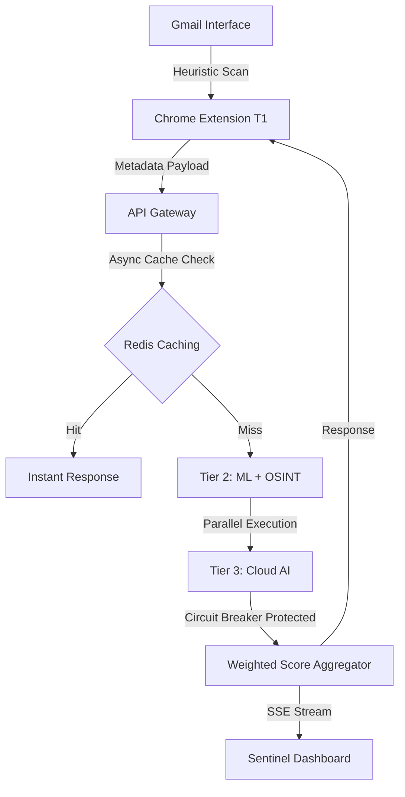

[ignoring loop detection]
<div align=\"center\">

# 🛡️ ZeroPhish

### **Enterprise-Grade AI Phishing Forensics & Real-Time Threat Intelligence**

[](https://python.org)
[](https://fastapi.tiangolo.com)
[](https://nextjs.org)
[](https://react.dev)
[](https://ai.google.dev)
[](LICENSE)

*A production-grade, 3-tier phishing detection system that analyzes Gmail emails in real-time using heuristics, ML, and Gemini AI — all from a high-performance Chrome Side Panel.*

[Explore Features](#-key-features) • [Deployment Guide](#-installation--setup) • [API Docs](#-api-reference) • [Roadmap](./FUTURE_SCOPE.md)

</div>

---

## 📖 Overview

**ZeroPhish** is a multi-layered security ecosystem designed to combat modern email threats like phishing, Business Email Compromise (BEC), and CEO Fraud. Unlike legacy solutions relying solely on blacklists, ZeroPhish uses a **Weighted 3-Tier Formula** to calculate a real-time risk verdict.

### 🧩 The 3-Tier Multi-Analysis Model

| Layer | Component | Logic | Purpose |
| :--- | :--- | :--- | :--- |
| **Tier 1** | Chrome Extension | Local Heuristics | Instant scraping & initial threat signals |
| **Tier 2** | Python Backend | ML + OSINT | Metadata, WHOIS, & DistilBERT intent analysis |
| **Tier 3** | Cloud AI | Gemini 1.5 Flash | Semantic reasoning & high-fidelity risk profiling |

#### 📊 Scoring Verdict Logic
> **Final Score = (T1 × 0.20) + (T2 × 0.30) + (T3 × 0.50)**

| Score Range | Verdict | Action Recommended |
| :--- | :--- | :--- |
| **0 – 29** | ✅ **SAFE** | No immediate risk detected. |
| **30 – 69** | ⚠️ **SUSPICIOUS** | Exercise caution, audit links. |
| **70 – 100** | 🚨 **CRITICAL** | High probability of phishing/fraud. |

---

## ✨ Key Features

### 🔍 Tier 1 — Client Sentinel (Chrome Extension)
- **Zero-Latency Heuristics**: Immediate keyword scoring for urgency, financial, and credential patterns.
- **Link Analysis**: Detects Punycode/homographs, IP-based URLs, and suspicious TLDs (`.zip`, `.tk`, `.xyz`).
- **Brand Spoofing Protection**: Validates sender domains against verified entities (Google, PayPal, Amazon).

### 🧠 Tier 2 — Metadata & OSINT Engine (Backend)
- **Typosquatting Detection**: Real-time Levenshtein distance profiling against top 100 enterprise brands.
- **Async Redirect Tracker**: Traces multi-hop shorteners (`bit.ly`, `tinyurl`) to expose hidden malicious endpoints.
- **Domain Age Profiling**: Automated WHOIS vetting flagging domains younger than 30 days.
- **Local ML Inference**: Integrated `DistilBERT` model (~97% accuracy) for low-latency text classification.
- **Redis Speed Layer**: Sub-10ms response caching via SHA-256 content hashing.

### 🤖 Tier 3 — Semantic AI Brain (Gemini 1.5 Flash)
- **Cognitive Reasoning**: Detects sophisticated BEC and CEO Fraud that evades pattern-based filters.
- **Business Logic Context**: Profiles for synthetic urgency hierarchies and fraudulent wire transfer requests.
- **Circuit Breaker Protected**: Seamless fallback to local T1/T2 signals if cloud AI is throttled or offline.

### 🛡️ Enterprise-Grade Operations
- **Sentinel Dashboard**: Real-time Forensics Panel with threat gauges, live status tickers, and technical logs.
- **Incident Management**: Lifecycle tracking for SOC teams to triage and manage threat reports.
- **Vision Inference Ready**: Dedicated `/vision/analyze` endpoint for screenshot-based pixel-perfect clone detection.
- **RBAC Authentication**: End-to-end OAuth-ready auth supporting Admins, Analysts, and Users.

---

## 🏗️ Architecture & Flow



---

## 🛠️ Tech Stack

| Layer | Technology | Purpose |
| :--- | :--- | :--- |
| **Backbone** | FastAPI, Uvicorn, Python 3.10+ | High-concurrency API Orchestration |
| **AI/ML** | Gemini 1.5 Flash, DistilBERT, PyTorch | Semantic reasoning & local inference |
| **Storage** | Redis (Asyncio) | High-speed content caching |
| **Extension** | Manifest V3, Vanilla JS | Browser-level heuristics & SidePanel UI |
| **Dashboard** | Next.js 15, React 19, Tailwind CSS | Real-time forensic visualization |
| **Security** | SlowAPI, Tenacity, Circuit-Breaker FSM | Rate limiting & fault tolerance |

---

## ⚙️ Installation & Setup

### Prerequisites
- Python 3.10+, Node.js 20+, pnpm
- Redis Server (Optional, for Speed Layer)
- Gemini API Key ([AI Studio](https://ai.google.dev/))

### 1. Backend Orchestrator
```bash
cd Backend
pip install -r requirements.txt
cp .env.example .env  # Configure GEMINI_API_KEY
python gateway.py      # Starts on port 8001
```

### 2. Tier 2 Logical Service
```bash
cd Backend/tier_2
python main.py         # Starts on port 8000
```

### 3. Sentinel Dashboard
```bash
cd Frontend
pnpm install
pnpm dev              # Dashboard at http://localhost:3000
```

### 4. Client Extension
- Load `Backend/extension/` as an unpacked extension in Chrome Developer Mode.
- Open Gmail to trigger the SidePanel.

---

## 📊 Performance & Reliability

| Tier | Component | Latency (Typical) | Fallback Mode |
| :--- | :--- | :--- | :--- |
| **Tier 1** | Browser Heuristics | < 50ms | Local Only |
| **Tier 2** | ML + Pattern Analysis | 200 – 500ms | Static Heuristics |
| **Tier 3** | Gemini AI Call | 1 – 3 seconds | Circuit Breaker (T1+T2) |
| **Cache** | Redis Hit | < 10ms | Direct Re-Analysis |

---

## 🧪 Testing & Validation

### Health Analysis
```bash
curl http://localhost:8001/gateway/health  # System-wide status
curl http://localhost:8001/gateway/circuit/status # Circuit Breaker state
```

### Mock Phishing Scan
```bash
curl -X POST http://localhost:8001/gateway/scan \
  -H \"Content-Type: application/json\" \
  -d '{
    \"sender\": \"ceo@suspicious-bank.tk\",
    \"subject\": \"URGENT: Verify account\",
    \"body\": \"Your credentials expire in 2 hours.\",
    \"links\": [\"https://suspicious-bank-login.tk/auth\"],
    \"tier1_score\": 72
  }'
```

---

## 🛡️ Production Deployment (Reference)

### Nginx Reverse Proxy
```nginx
server {
    listen 443 ssl http2;
    server_name api.zerophish.io;
    location / {
        proxy_pass http://localhost:8001;
        proxy_set_header X-Real-IP $remote_addr;
        proxy_set_header X-Forwarded-For $proxy_add_x_forwarded_for;
    }
}
```

### Systemd Configuration
```ini
[Unit]
Description=ZeroPhish Gateway
After=network.target

[Service]
ExecStart=/usr/bin/python3 gateway.py
WorkingDirectory=/opt/zerophish/Backend
Restart=always

[Install]
WantedBy=multi-user.target
```

---

## 📁 Related Documentation

| Document | Purpose |
| :--- | :--- |
| [`FUTURE_SCOPE.md`](./FUTURE_SCOPE.md) | Strategic roadmap & long-term evolution |
| [`PROJECT_AUDIT_REPORT.md`](./PROJECT_AUDIT_REPORT.md) | Technical debt & security remediation audit |
| [`TESTING_AND_DEPLOYMENT.md`](./TESTING_AND_DEPLOYMENT.md) | Full testing checklist & staging guide |
| [`EXTENSION_FIX_GUIDE.md`](./EXTENSION_FIX_GUIDE.md) | Extension troubleshooting & permission debugs |
| [`RELOAD_EXTENSION_INSTRUCTIONS.md`](./RELOAD_EXTENSION_INSTRUCTIONS.md) | Step-by-step Chrome SidePanel refresh guide |

---

## 🤝 Contributing & License

We welcome pull requests! Please see [CONTRIBUTING.md](CONTRIBUTING.md) for development workflows.
Distributed under the **MIT License**.

---

<div align=\"center\">

**ZeroPhish — Zero tolerance for phishing.**

[Documentation](https://docs.zerophish.ai) • [Issues](https://github.com/Sarvadnya07/ZeroPhish/issues)

</div>
