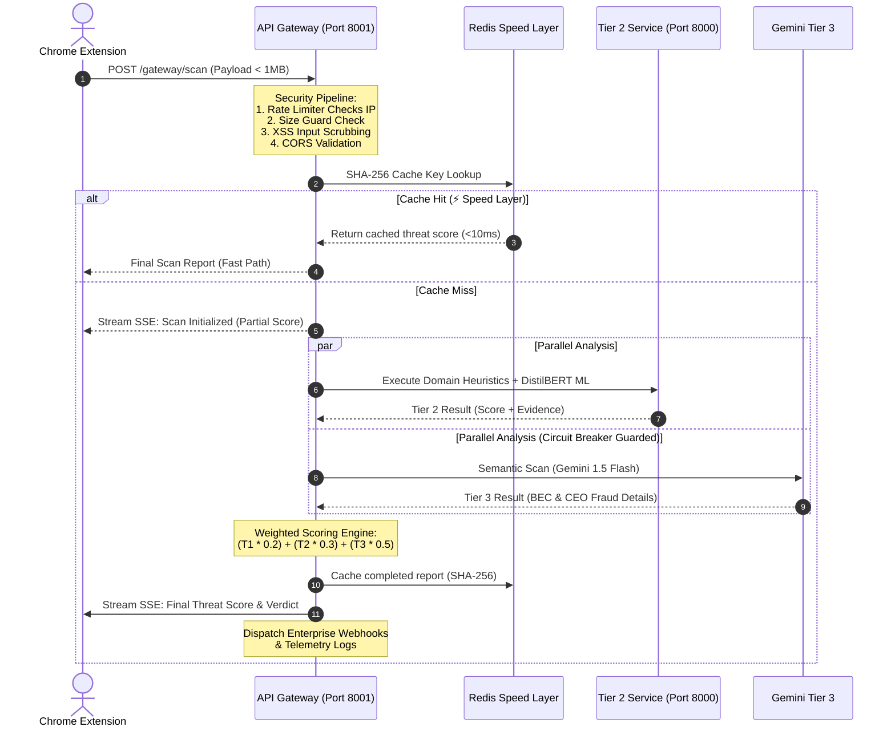

<div align="center">

# 🛡️ ZeroPhish

### **AI-Powered Phishing Detection for Gmail**

[](https://python.org)
[](https://fastapi.tiangolo.com)
[](https://nextjs.org)
[](https://developer.chrome.com/docs/extensions/mv3/)
[](https://ai.google.dev)
[](LICENSE)

*A production-grade, 3-tier phishing detection system that analyzes Gmail emails in real-time using heuristics, ML, and Gemini AI — all from a Chrome Side Panel.*

</div>

---

## 📖 Overview

**ZeroPhish** is an enterprise-quality email threat detection platform that protects users from phishing, spam, and social engineering attacks in real time. It is composed of three tightly integrated components:

| Component | Technology | Purpose |
|-----------|-----------|---------|
| **Chrome Extension** | Manifest V3, Vanilla JS | Email scraping & Tier 1 heuristic scoring in-browser |
| **Backend API** | Python, FastAPI, uvicorn | Tier 2 metadata analysis (WHOIS, ML, threat patterns) & Tier 3 AI (Gemini) |
| **Frontend Dashboard** | Next.js 16, React 19, TypeScript | Real-time scan visualization using Server-Sent Events |

The final threat score uses a **weighted 3-tier formula**:

> **Final Score = (T1 × 0.20) + (T2 × 0.30) + (T3 × 0.50)**

| Score Range | Verdict |
|-------------|---------|
| 0 – 29 | ✅ **SAFE** |
| 30 – 69 | ⚠️ **SUSPICIOUS** |
| 70 – 100 | 🚨 **CRITICAL / PHISHING** |

---

## ✨ Key Features

### 🔍 Tier 1 — Local Heuristic Engine (Chrome Extension)
- Runs **fully client-side**, zero latency, zero network calls
- **Keyword scoring**: urgency, financial, credential, scare-tactic patterns
- **Link analysis**: punycode/homograph detection, IP-based URLs, URL shorteners, suspicious TLDs (`.zip`, `.tk`, `.xyz`, etc.)
- **Sender analysis**: brand spoofing detection (Google, Microsoft, PayPal, Apple, Amazon), domain allowlist, email homograph detection
- **False-positive mitigation**: verified related-domain mapping (e.g., `gmail.com ↔ google.com`)

### 🧠 Tier 2 — Metadata & OSINT Analysis (Backend)
- **Real-Time Typosquatting Engine**: High-performance Levenshtein distance calculator protecting against top 50 spoofed enterprise brands (`paypaI`, `arnazon`).
- **Async Redirect Chain Tracker**: Embedded `httpx.AsyncClient` traces suspected URL shorteners (`bit.ly`, `tinyurl`) to their final destination, flagging hidden malicious TLDs dynamically.
- **WHOIS domain age check**: New domains (`< 30 days`) scored critically.
- **Threat pattern engine**: Pre-compiled regex matching for advanced linguistic analysis.
- **ML model integration**: Fine-tuned DistilBERT (`cybersectony/phishing-email-detection-distilbert_v2.1`) — **97%+ accuracy**.
- **Redis Speed Layer**: 5-minute response caching via SHA-256 key hashing to ensure < 2.0s analysis overhead.
- **Combined scoring**: `ML (60%) + Pattern/OSINT (40%)` fusion for maximal precision.

### 🤖 Tier 3 — Semantic AI Brain (Gemini 1.5 Flash)
- Powered by **Google Gemini 1.5 Flash** with JSON-mode enforcement.
- **Business Email Compromise (BEC) & CEO Fraud Detection**: Actively profiles for synthetic urgency hierarchies ("Are you at your desk?", urgent wire transfers).
- **Zero-Day Impersonation Engine**: Autonomously triggers `requires_visual_check=True` flags for suspect landing pages, paving the way for pixel-by-pixel CNN vision analysis.
- Classifies emails into: `BEC`, `CEO_Fraud`, `Financial`, `Urgency`, `Credential`, `Impersonation`, `Safe`, or `AI_UNAVAILABLE`.
- Graceful degradation: Timeout/parse errors return neutral fallback scores, ensuring service continuity.
- Protected by a full **Circuit Breaker** (CLOSED → OPEN → HALF_OPEN recovery).

### 🔐 Security Hardening
- **Rate limiting**: 20 scans/minute per IP via `slowapi`
- **Input validation**: XSS scrubbing, email format checks, field length limits
- **Request size limit**: 1MB maximum body size
- **Security headers middleware**: HSTS, X-Frame-Options, X-Content-Type-Options, CSP
- **CORS**: environment-based allowlist with regex support for extension IDs
- **API Key authentication** (optional for production)

### 🕵️‍♀️ Vision & Behavioral Analysis (New)
- **CNN Inference Ready**: Dedicated Vision API endpoint `/vision/analyze` processing browser DOM screenshots from the side panel to detect disguised corporate credentials via visual artifacts.
- **Credential Intercepts**: The "Quick Visual Check" UI feature parses exact DOM rendering structures to intercept pixel-perfect clones acting as spoofed domains.

### 🛡️ Core Enterprise Modules (New in v2.0)
- **RBAC Authentication**: End-to-end OAuth-ready authentication supporting Admins, Analysts, Users, and Read-only views.
- **Incident Management**: Automated Ticketing UI and lifecycle management for Security Operations Centers to triage threat reports.
- **Deep EML Scanner**: Standalone forensic dashboard to drop `.eml` files for rigorous raw-header DMARC/DKIM analysis and deep static attachment triage.
- **Security Training**: Interactive awareness module allocating 'XP', tracking live performance quizzes, and dynamically adapting to a user's `Personal Risk Score`.
- **Advanced Telemetry**: Admin panels tracking 7x24 global threat heatmaps, Live threat feeds, False-Positive workflows, and automated Webhook dispatching (e.g. firing Slack alerts on `SCAN_CRITICAL`).

### 📡 Real-Time Dashboard
- Server-Sent Events (SSE) stream for live scan updates
- Tactical `sentinel-panel`, `forensics-panel`, analysis pipeline visualization
- Threat gauge, tech logs, status ticker components
- Built with **Next.js 16**, **Tailwind CSS**, **Radix UI**, **Framer Motion**, and **Recharts**

---

## 🏗️ Architecture

ZeroPhish utilizes a high-throughput, **3-Tier Orchestration Architecture** with robust security guardrails, async execution patterns, a circuit breaker for semantic AI queries, and a high-performance **Redis Speed Layer** caching tier. 

### 📂 File Structure Directory Tree

```
ZeroPhish/
├── Backend/
│   ├── main.py                 # Local BERT + T3-aggregation FastAPI server (port 8000)
│   ├── gateway.py              # API Gateway orchestrator (port 8001)
│   ├── gateway_circuit_wrapper.py  # Circuit-breaker wrapper for Tier 3 calls
│   ├── circuit_breaker.py      # Circuit breaker: CLOSED/OPEN/HALF_OPEN FSM
│   ├── requirements.txt        # Python dependencies
│   ├── .env.example            # Environment configuration template
│   ├── pyproject.toml          # Project build config
│   │
│   ├── extension/              # Chrome Extension (Manifest V3)
│   │   ├── manifest.json       # Extension config & permissions
│   │   ├── tier1.js            # Heuristic scoring engine (client-side)
│   │   ├── sidepanel.js        # Main side panel logic
│   │   ├── sidepanel_gateway.js # Gateway integration mode
│   │   ├── sidepanel.html      # Side panel UI
│   │   ├── content.js          # Gmail page content script
│   │   ├── background.js       # Service worker
│   │   ├── worker.js           # Background worker
│   │   └── style.css           # Extension styles
│   │
│   ├── tier_2/                 # Tier 2: Metadata & ML Analysis
│   │   ├── main.py             # FastAPI service + ThreatAnalyzer engine + SpeedLayerCache
│   │   ├── ml_model.py         # HuggingFace DistilBERT integration
│   │   ├── whois_client.py     # Enhanced WHOIS lookup with caching
│   │   ├── threat_patterns.json # Regex threat database (urgency/financial/credential)
│   │   └── benchmark*.py       # Performance benchmarking scripts
│   │
│   ├── tier_3/                 # Tier 3: Semantic AI (Gemini)
│   │   ├── main.py             # T3Service: Gemini 1.5 Flash integration
│   │   └── __init__.py
│   │
│   ├── models/                 # Pydantic API models for the gateway
│   ├── security/               # Security middleware (input validation, headers)
│   └── tests/                  # Test suite
│
└── Frontend/                   # Next.js 16 Dashboard
    ├── app/
    │   ├── layout.tsx          # App shell
    │   ├── page.tsx            # Main page
    │   └── globals.css
    ├── components/
    │   ├── sentinel/           # Core dashboard components
    │   │   ├── sentinel-panel.tsx      # Main scan display panel
    │   │   ├── forensics-panel.tsx     # Detailed evidence viewer
    │   │   ├── analysis-pipeline.tsx   # 3-tier pipeline visualization
    │   │   ├── threat-gauge.tsx        # Animated threat score gauge
    │   │   ├── tactical-actions.tsx    # Action buttons
    │   │   ├── status-ticker.tsx       # Live status ticker
    │   │   └── tech-logs.tsx           # Technical log viewer
    │   └── ui/                 # Radix UI / shadcn components
    ├── hooks/                  # Custom React hooks
    ├── lib/                    # Utility functions
    └── package.json
```

### 🔄 End-to-End System Architecture & Data Flow

Below is the complete visual blueprint of the ZeroPhish architecture. It details how data is ingested, validated, checked against a Redis caching layer, analyzed in parallel across three specialized evaluation tiers, fused into a single weighted threat index, and streamed via Server-Sent Events (SSE) to real-time dashboards and third-party alert channels.

```mermaid
flowchart TD
    %% Styling and colors
    classDef client fill:#3b82f6,stroke:#1d4ed8,stroke-width:2px,color:#fff;
    classDef gateway fill:#8b5cf6,stroke:#6d28d9,stroke-width:2px,color:#fff;
    classDef t2 fill:#10b981,stroke:#047857,stroke-width:2px,color:#fff;
    classDef t3 fill:#ec4899,stroke:#be185d,stroke-width:2px,color:#fff;
    classDef cache fill:#f59e0b,stroke:#b45309,stroke-width:2px,color:#fff;
    classDef ui fill:#06b6d4,stroke:#0891b2,stroke-width:2px,color:#fff;

    %% 1. Ingestion Layer
    A["Gmail UI / EML Upload"] --> B["Chrome Ext / Web Gateway"]:::client
    B --> C["Tier 1: Heuristics (20%)"]:::client

    %% 2. Gateway & Security
    B --> D["API Gateway (Port 8001)"]:::gateway
    D --> E["Security: Rate Limit, Size Guard, XSS, CORS"]:::gateway
    E --> F{"Redis Cache Hit?"}:::cache
    
    F -->|Yes (<10ms)| G["Skip Pipeline & Return Report"]:::cache
    F -->|No (Miss)| H["Orchestration Router (Async)"]:::gateway

    %% 3. Parallel Processing Pipeline
    H -->|Trigger| T2_Box
    H -->|Trigger| T3_Box

    subgraph T2_Box ["Tier 2: Metadata & ML (30%)"]
        direction TB
        T2_1["DistilBERT ML Engine"]:::t2
        T2_2["WHOIS Domain Age"]:::t2
        T2_3["Typosquatting (Levenshtein)"]:::t2
        T2_4["Async Redirect Tracker"]:::t2
        T2_5["Threat Pattern Regex"]:::t2
        T2_1 & T2_2 & T2_3 & T2_4 & T2_5 --> T2_Calc["Calculate T2 Score"]:::t2
    end

    subgraph T3_Box ["Tier 3: Semantic AI (50%)"]
        direction TB
        CB{"Circuit Breaker"}:::t3
        CB -->|CLOSED| T3_1["Gemini 1.5 Flash (BEC/Fraud)"]:::t3
        CB -->|OPEN| T3_2["Graceful Fallback (Neutral)"]:::t3
        T3_1 & T3_2 --> T3_Calc["Calculate T3 Score"]:::t3
    end

    %% 4. Score Fusion & Output
    C --> Agg["Weighted Score Aggregator"]:::gateway
    T2_Calc --> Agg
    T3_Calc --> Agg

    Agg --> Res["Final Verdict & Threat Score"]:::gateway
    Res --> Push["Push to Redis Cache"]:::cache
    Res --> SSE["SSE Live Stream"]:::gateway
    
    %% 5. View Layer
    SSE --> UI_1["Chrome Side Panel UI"]:::ui
    SSE --> UI_2["Next.js Forensic Dashboard"]:::ui
    SSE --> UI_3["Enterprise Webhooks (Slack)"]:::ui
```

#### 🛡️ 1. Client & Ingest Layer
- **Gmail Scraper:** Manifest V3 background scripts and content scripts monitor the browser workspace securely. Upon activation, they compile email structural elements (sender address, text body, extracted URLs) dynamically.
- **In-Browser Heuristics (Tier 1):** A light-weight client-side engine executes pattern checks for immediate responsiveness. It flags brand domains mismatches, urgent titles, and Punycode URL spoofing instantly.

#### 🔒 2. Security Shield & API Gateway
All scans transit through the central API Gateway (Port 8001) which maintains a strict zero-trust posture:
- **Rate-Limiting:** Leverages `slowapi` to enforce strict rate limits (`20 scans/min` for main endpoint, `120 scans/min` for statuses).
- **Request Constraints:** Implements a strict `1MB` payload size limit to reject malformed buffer overflows.
- **Payload Scrubbing:** Rejects scripts and invalid inputs using recursive XSS sanitization filters.
- **CORS Allowlist:** Matches requester origins strictly with allowed Next.js server addresses and designated Chrome Extension ID hashes.

#### ⚡ 3. Redis Speed Layer (Caching)
- **SHA-256 Key Hashing:** The Gateway converts the sender and partial body elements into a unique hash key.
- **Ultra-Low Latency:** Queries Redis for matching records. Upon a cache hit, the gateway skips all processing pipelines and returns the full verdict report in **< 10ms**.
- **Failsafe Storage:** Completed scans are automatically pushed to the cache with configurable time-to-live records (5 minutes to 24 hours), avoiding redundant ML or API consumption.

#### 🔄 4. 3-Tier Multi-Analysis Pipeline
If the request is a cache miss, the gateway fires asynchronous threads to evaluate the threat:
- **Tier 2 Engine (Port 8000):** Focuses on linguistic patterns, OSINT, and machine learning:
  - **Typosquatting Engine:** Computes Levenshtein edit distance values against the top 50 highly spoofed domains (e.g. `paypa1.com`, `bankofarnica.com`).
  - **WHOIS Client:** Connects to active WHOIS lookup libraries. New domains (under 30 days) receive critical penalties.
  - **Redirect Tracker:** Uses `httpx` asynchronous loops to expand shortened links (e.g. `bit.ly`) and catch hidden malicious TLDs.
  - **ML Text Classifier:** Runs a fine-tuned HuggingFace DistilBERT model returning high-accuracy threat classifications.
- **Tier 3 Semantic AI Engine (Google Gemini 1.5 Flash):** Profiles complex Business Email Compromise (BEC) and CEO impersonation patterns.
  - **FSM Circuit Breaker Guard:** Controlled by a robust circuit breaker state machine (`CLOSED ↔ OPEN ↔ HALF_OPEN`). If Gemini experiences rate limits, timeouts, or network problems, the breaker opens, protecting downstream services and returning a safe fallback neutral score.

#### 📊 5. Score Fusion, Telemetry & Real-Time SSE
- **Fusion Engine:** Evaluates scores against standard weights: `(T1 × 0.20) + (T2 × 0.30) + (T3 × 0.50)` to output final threat scores and verdicts (`SAFE`, `SUSPICIOUS`, `CRITICAL`).
- **Live SSE Streaming:** Streams progress status logs and partial scores immediately to the Sentinel Panel dashboard, so security operations analysts never wait for long-running AI queries to complete.
- **Automation & Telemetry:** Fuses analytics telemetry database records, schedules background webhooks, and dispatches critical Slack notifications.

---

## ⚙️ Installation & Setup

### Prerequisites

- **Python 3.10+**
- **Node.js 18+** and **pnpm** (or npm)
- **Redis** (optional, for caching — falls back gracefully without it)
- **Google Chrome** (for the extension)
- A **Gemini API Key** from [Google AI Studio](https://ai.google.dev/) (optional — Tier 3 is skipped without it)

---

### 1. Clone the Repository

```bash
git clone https://github.com/Sarvadnya07/ZeroPhish.git
cd ZeroPhish
```

### 2. Configure the Backend Environment

```bash
cd Backend
cp .env.example .env
```

Edit `.env` and fill in your values:

```env
# Required for Tier 3 AI analysis
GEMINI_API_KEY=your_actual_gemini_api_key_here

# CORS origins (comma-separated)
ALLOWED_ORIGINS=http://localhost:3000,http://localhost:8000

# Optional: Redis for caching
REDIS_URL=redis://localhost:6379

# Optional: API key for production security
# API_KEY=your_secure_api_key_here

# Tier 3 (Gemini) timeout in seconds
TIER3_TIMEOUT=5
```

### 3. Install Backend Dependencies

```bash
cd Backend
pip install -r requirements.txt
```

> **Note for Windows:** If you encounter issues with `torch`, install the CPU-only version:
> ```bash
> pip install torch --index-url https://download.pytorch.org/whl/cpu
> ```

### 4. Start the Backend Services

Open **two terminals**:

**Terminal 1 — Tier 2 Analysis Backend (port 8000):**
```bash
cd Backend/tier_2
python main.py
```

**Terminal 2 — API Gateway (port 8001):**
```bash
cd Backend
python gateway.py
```

Verify services are running:
```bash
curl http://localhost:8000/health
curl http://localhost:8001/gateway/health
```

### 5. Install & Run the Frontend Dashboard

```bash
cd Frontend
pnpm install   # or: npm install
pnpm dev       # or: npm run dev
```

Open [http://localhost:3000](http://localhost:3000)

### 6. Load the Chrome Extension

1. Open **Chrome** and navigate to `chrome://extensions/`
2. Enable **Developer mode** (top-right toggle)
3. Click **"Load unpacked"**
4. Select the `Backend/extension/` folder
5. The **ZeroPhish** icon will appear in your Chrome toolbar

---

## 🚀 Usage

1. **Open Gmail** in Chrome
2. **Click the ZeroPhish icon** in the Chrome toolbar to open the Side Panel
3. **Open any email** in Gmail
4. **Click "Initialize Scan"** in the side panel
5. ZeroPhish will:
   - Run **Tier 1** heuristics instantly (client-side)
   - Send data to the **Gateway** for Tier 2 & Tier 3 analysis
   - Display a live **threat score**, **verdict**, and **evidence breakdown**
6. **Open the Dashboard** at [http://localhost:3000](http://localhost:3000) to see real-time scan results with a full forensics view

---

## 🔌 API Reference

### Gateway Orchestrator (Port 8001)

| Method | Endpoint | Description |
|--------|----------|-------------|
| `POST` | `/gateway/scan` | Submit email for full 3-tier analysis |
| `GET` | `/gateway/status/{scan_id}` | Poll scan status (Tier 3 pending) |
| `GET` | `/gateway/result/{scan_id}` | Retrieve completed scan result |
| `GET` | `/gateway/health` | Gateway health & circuit breaker status |
| `POST` | `/vision/analyze` | Submit image for CNN heuristic vision scoring |
| `GET` | `/auth/me` | Fetch active User/RBAC context |
| `GET` | `/email/scan-eml` | Upload and sanitize raw .eml file traces |
| `GET` | `/analytics/threat-feed` | Fetch live IOCs and heuristics across the platform |

### Tier 2 Backend (Port 8000)

| Method | Endpoint | Description |
|--------|----------|-------------|
| `POST` | `/scan` | Direct Tier 2 scan (WHOIS + patterns + ML) |
| `POST` | `/tier1/report` | Receive scan report from extension |
| `GET` | `/tier1/latest` | Get the most recent scan result |
| `GET` | `/tier1/stream` | SSE stream for real-time dashboard updates |
| `GET` | `/health` | Service health check |
| `GET` | `/cache/stats` | Redis cache statistics |
| `DELETE` | `/cache/clear` | Clear all cached results |

### Example Scan Request

```bash
curl -X POST http://localhost:8001/gateway/scan \
  -H "Content-Type: application/json" \
  -d '{
    "sender": "security@suspicious-bank.xyz",
    "subject": "URGENT: Verify your account now",
    "body": "Your account has been suspended. Click here immediately to verify your credentials and avoid losing access.",
    "links": ["http://192.168.1.1/verify", "http://paypa1.com/secure"],
    "tier1_score": 72,
    "tier1_evidence": ["Urgency keyword", "IP-based URL", "Brand mismatch"]
  }'
```

---

## 🛠️ Tech Stack

| Layer | Technology | Version |
|-------|-----------|---------|
| **API Framework** | FastAPI + Uvicorn | 0.115.6 / 0.32.1 |
| **AI (Tier 3)** | Google Gemini 1.5 Flash | `google-generativeai` 0.8.3 |
| **ML (Tier 2)** | HuggingFace Transformers + DistilBERT | 4.47.1 |
| **Deep Learning** | PyTorch | 2.5.1+ |
| **Data Models** | Pydantic | 2.10.5 |
| **Caching** | Redis (asyncio) | 5.2.1 |
| **Rate Limiting** | SlowAPI | 0.1.9 |
| **Domain Analysis** | python-whois | 0.9.4 |
| **HTTP Client** | httpx | 0.28.1 |
| **Reliability** | tenacity | 9.0.0 |
| **Frontend** | Next.js 16 + React 19 + TypeScript | 16.1.6 |
| **Styling** | Tailwind CSS + Radix UI | 3.4.x |
| **Animation** | Framer Motion | 11.x |
| **Charts** | Recharts | 2.15.0 |
| **Extension** | Chrome Manifest V3 | — |

---

## 🔧 Configuration Reference

All configuration is driven by the `Backend/.env` file. Key variables:

| Variable | Default | Description |
|----------|---------|-------------|
| `GEMINI_API_KEY` | — | Google Gemini API key (required for Tier 3) |
| `GATEWAY_PORT` | `8001` | Gateway server port |
| `TIER3_TIMEOUT` | `5` | Max seconds to wait for Gemini AI response |
| `ALLOWED_ORIGINS` | `http://localhost:3000` | CORS-allowed origins (comma-separated) |
| `ALLOW_ORIGIN_REGEX` | — | Regex to allow specific Chrome extension IDs |
| `REDIS_URL` | `redis://localhost:6379` | Redis connection URL |
| `ML_ENABLED` | `true` | Enable/disable DistilBERT ML model |
| `CIRCUIT_BREAKER_ENABLED` | `true` | Enable Tier 3 circuit breaker |
| `CIRCUIT_BREAKER_FAILURE_THRESHOLD` | `5` | Failures before circuit opens |
| `CIRCUIT_BREAKER_TIMEOUT` | `30` | Seconds before circuit attempts recovery |
| `ZERO_PHISH_DISABLE_ML` | — | Set to `1` to disable local BERT |
| `ZERO_PHISH_HF_MODEL` | `distilbert-base-uncased-finetuned-sst-2-english` | HuggingFace model ID |

---

## 📊 Performance Benchmarks

| Tier | Component | Expected Latency |
|------|-----------|-----------------|
| **Tier 1** | Chrome Extension (heuristics) | < 50ms |
| **Tier 2** | Pattern matching + ML inference | 200 – 500ms |
| **Tier 3** | Gemini API call | 1 – 3 seconds |
| **Total** | Full 3-tier scan | 1.5 – 3.5 seconds |
| **Cache hit** | Redis cached result | < 10ms |

**Resource Usage:**
- Memory: ~500MB – 1GB (with ML model loaded)
- CPU: 10–30% during active scans
- Disk: ~2GB for ML model weights + cache

---

## 🧪 Testing

### Health Checks

```powershell
# Tier 2 Backend
curl http://localhost:8000/health

# API Gateway
curl http://localhost:8001/gateway/health

# Circuit Breaker Status
curl http://localhost:8001/gateway/circuit/status
```

### Phishing Detection Test

```powershell
curl -X POST http://localhost:8000/scan `
  -H "Content-Type: application/json" `
  -d '{
    "sender": "urgent@suspicious-bank.com",
    "body": "URGENT: Your account will be suspended. Verify your password immediately!",
    "links": ["http://phishing-site.com/verify"]
  }'
# Expected: threat score 70+, verdict: CRITICAL
```

### Security Tests

```powershell
# Rate limiting (expect 429 after 20 req/min)
for ($i=1; $i -le 25; $i++) {
    curl -X POST http://localhost:8001/gateway/scan `
      -H "Content-Type: application/json" `
      -d '{"sender":"t@t.com","body":"test","links":[],"tier1_score":0,"tier1_evidence":[]}'
}

# Request size limit (expect 413)
$largeBody = "A" * 2000000
curl -X POST http://localhost:8001/gateway/scan `
  -H "Content-Type: application/json" `
  -d "{`"sender`":`"t@t.com`",`"body`":`"$largeBody`",`"links`":[],`"tier1_score`":0,`"tier1_evidence`":[]}"
```

---

## 🔒 Security Architecture

ZeroPhish adheres to strict secure coding principles. The security subsystem intercepts all scan executions through modular filters before they can consume deep learning inference servers or cloud AI endpoints.

### 🛡️ Request Validation & Parallel Processing Sequence

The sequence diagram below displays the step-by-step security interception, caching bypass logic, and parallel execution pipeline:



### ⚙️ Production Hardening Security Controls

ZeroPhish implements a robust, multi-layer security posture:

- **🛡️ Rate Limiting:** Enforced via `slowapi` at the gateway level. Rates are capped at `20 requests/minute` per IP address for scans, and `120 requests/minute` for status queries to prevent Denial of Service (DoS) and API abuse.
- **📏 Strict Size Constraints:** Integrates a custom FastAPI request size limiting middleware, rejecting any request bodies larger than `1MB` at the network level.
- **🧼 XSS & Linguistic Sanitization:** An active `InputValidator` scrubs all text elements, blocking cross-site scripting attempts and validating email addresses and URLs against pre-compiled regex limits.
- **🔒 Security Header Middleware:** Injects modern security-hardening response headers:
  - `Strict-Transport-Security (HSTS)` to force HTTPS connections
  - `Content-Security-Policy (CSP)` defining strict trusted script origins
  - `X-Frame-Options: DENY` to block clickjacking attacks
  - `X-Content-Type-Options: nosniff` to prevent MIME-type sniffing
- **🌍 Dynamic CORS Protection:** REST API endpoints only respond to origins mapped in the `ALLOWED_ORIGINS` environment setup or specific Chrome Extension ID regex configurations (`ALLOW_ORIGIN_REGEX`).
- **⚡ SHA-256 Caching Hashing:** Scan payloads are hashed securely. Only hashes are stored as keys in Redis, protecting user data from exposed scanning records.
- **🔌 Fault-Tolerant Circuit Breakers:** Tier 3 AI integrations are protected by a state-machine based circuit breaker. If Google Gemini experiences high latencies or API failures, the gateway isolates the endpoint automatically, protecting local ML and scanning features.

---

## 🚀 Production Deployment

### Environment Setup

```env
# Production .env
GATEWAY_PORT=443
TIER3_TIMEOUT=5
ALLOWED_ORIGINS=https://yourdomain.com
GEMINI_API_KEY=your_production_key
REDIS_URL=redis://your-redis-host:6379
CIRCUIT_BREAKER_ENABLED=true
ML_ENABLED=true
```

### Nginx Reverse Proxy

```nginx
server {
    listen 443 ssl http2;
    server_name api.yourdomain.com;

    ssl_certificate /path/to/cert.pem;
    ssl_certificate_key /path/to/key.pem;

    location / {
        proxy_pass http://localhost:8001;
        proxy_set_header Host $host;
        proxy_set_header X-Real-IP $remote_addr;
        proxy_set_header X-Forwarded-For $proxy_add_x_forwarded_for;
        proxy_set_header X-Forwarded-Proto $scheme;
    }
}
```

### Systemd Service

```ini
[Unit]
Description=ZeroPhish API Gateway
After=network.target

[Service]
Type=simple
User=www-data
WorkingDirectory=/path/to/ZeroPhish/Backend
Environment="PATH=/path/to/venv/bin"
ExecStart=/path/to/venv/bin/python gateway.py
Restart=always

[Install]
WantedBy=multi-user.target
```

---

## 📁 Related Documentation

| File | Description |
|------|-------------|
| [`TESTING_AND_DEPLOYMENT.md`](./TESTING_AND_DEPLOYMENT.md) | Full testing checklist & deployment guide |
| [`Backend/QUICK_REFERENCE.md`](./Backend/QUICK_REFERENCE.md) | Quick API & config reference |
| [`Backend/GEMINI_INTEGRATION_STATUS.md`](./Backend/GEMINI_INTEGRATION_STATUS.md) | Tier 3 AI integration notes |
| [`EXTENSION_FIX_GUIDE.md`](./EXTENSION_FIX_GUIDE.md) | Extension troubleshooting guide |
| [`RELOAD_EXTENSION_INSTRUCTIONS.md`](./RELOAD_EXTENSION_INSTRUCTIONS.md) | How to reload the Chrome extension |

---

## 🤝 Contributing

1. Fork the repository
2. Create your feature branch: `git checkout -b feature/amazing-feature`
3. Commit your changes: `git commit -m 'Add amazing feature'`
4. Push to the branch: `git push origin feature/amazing-feature`
5. Open a Pull Request

---

## 📝 License

This project is open-source and available under the [MIT License](LICENSE).

---

<div align="center">

**Built with ❤️ to keep inboxes safe.**

*ZeroPhish — Zero tolerance for phishing.*

</div>
