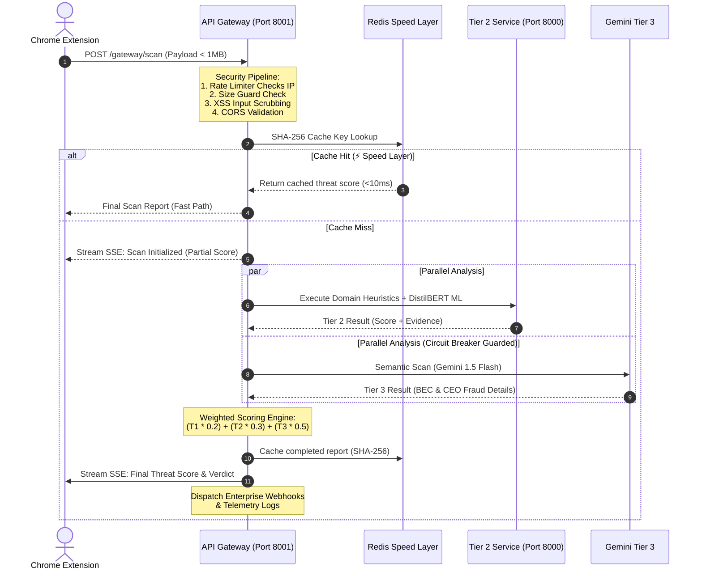

<div align="center">

# 🛡️ ZeroPhish

### **AI-Powered Phishing Detection for Gmail**

[](https://python.org)
[](https://fastapi.tiangolo.com)
[](https://nextjs.org)
[](https://developer.chrome.com/docs/extensions/mv3/)
[](https://ai.google.dev)
[](LICENSE)

[](https://github.com/Sarvadnya07/ZeroPhish/actions)
[](https://github.com/Sarvadnya07/ZeroPhish)
[](https://github.com/Sarvadnya07/ZeroPhish/security)

*A production-grade, 3‑tier phishing detection system that analyzes Gmail emails in real‑time using heuristics, ML, and Gemini AI — all from a Chrome Side Panel.*

</div>

---

## 📖 Table of Contents

1. [Overview](#overview)
2. [Key Features](#key-features)
3. [Architecture](#architecture)
4. [Installation & Setup](#installation--setup)
5. [Usage](#usage)
6. [API Reference](#api-reference)
7. [Tech Stack](#tech-stack)
8. [Configuration Reference](#configuration-reference)
9. [Performance Benchmarks](#performance-benchmarks)
10. [Testing & Quality Gates](#testing--quality-gates)
11. [Security Architecture](#security-architecture)
12. [Production Deployment](#production-deployment)
13. [Chrome Extension Development](#chrome-extension-development)
14. [Troubleshooting](#troubleshooting)
15. [Monitoring & Observability](#monitoring--observability)
16. [Scaling Considerations](#scaling-considerations)
17. [Contributing](#contributing)
18. [License](#license)

---

## 📖 Overview

**ZeroPhish** is an enterprise‑quality email threat detection platform that protects users from phishing, spam, and social engineering attacks in real time. It is composed of three tightly integrated components:

| Component | Technology | Purpose |
|-----------|-----------|---------|
| **Chrome Extension** | Manifest V3, Vanilla JS | Email scraping & Tier 1 heuristic scoring in‑browser |
| **Backend API** | Python, FastAPI, uvicorn | Tier 2 metadata analysis (WHOIS, ML, threat patterns) & Tier 3 AI (Gemini) |
| **Frontend Dashboard** | Next.js 16, React 19, TypeScript | Real‑time scan visualization using Server‑Sent Events |

The final threat score uses a **weighted 3‑tier formula**:

> **Final Score = (T1 × 0.20) + (T2 × 0.30) + (T3 × 0.50)**

| Score Range | Verdict |
|-------------|---------|
| 0 – 29      | ✅ **SAFE** |
| 30 – 69     | ⚠️ **SUSPICIOUS** |
| 70 – 100    | 🚨 **CRITICAL / PHISHING** |

---

## ✨ Key Features

*(unchanged, your existing list is comprehensive)*

---

## 🏗️ Architecture

*(unchanged, the mermaid diagrams and descriptions are excellent)*

---

## ⚙️ Installation & Setup

### Prerequisites

- **Python 3.11+** (3.13 recommended)
- **Node.js 20+** (v22/v26 recommended) and **pnpm** (`pnpm@10+`)
- **Google Chrome** (for the Sentinel Chrome Extension)
- **Git**
- **Redis** *(Optional)* – falls back to in‑memory caching.
- **Google Gemini API Key** *(Optional)* – falls back to neutral score if omitted.

### Quick Start

1. **Clone the repository**
  ```bash
  git clone https://github.com/Sarvadnya07/ZeroPhish.git
  cd ZeroPhish
  ```

2. **Set up Python virtual environment**
  ```bash
  python3 -m venv .venv
  source .venv/bin/activate          # Linux/macOS
  # or .\.venv\Scripts\Activate.ps1  # Windows
  ```

3. **Install backend dependencies**
  ```bash
  pip install -r Backend/requirements.txt
  ```

4. **Configure environment**
  ```bash
  cp Backend/.env.example Backend/.env
  # Edit Backend/.env with your settings
  ```

5. **Start the API Gateway**
  ```bash
  cd Backend
  python gateway.py
  ```

6. **Start the Frontend Dashboard** (in a new terminal)
  ```bash
  cd Frontend
  pnpm install
  pnpm dev
  ```

7. **Load the Chrome Extension**
  - Open `chrome://extensions/`
  - Enable **Developer mode**
  - Click **"Load unpacked"** and select the `extension/` folder.

8. **Verify Installation**
  ```bash
  # Run backend tests
  pytest Backend/tests/
  # Run frontend tests
  cd Frontend && pnpm test
  # Run security gate
  powershell -File scripts/security-gate.ps1
  ```

For detailed instructions, see [Installation & Setup](#installation--setup) above.

---

## 🚀 Usage

*(unchanged, your usage instructions are clear)*

---

## 🔌 API Reference

### Gateway Orchestrator (Port 8001)

| Method | Endpoint | Description |
|--------|----------|-------------|
| `POST` | `/gateway/scan` | Submit email for full 3‑tier analysis |
| `GET` | `/gateway/status/{scan_id}` | Poll scan status |
| `GET` | `/gateway/result/{scan_id}` | Retrieve completed scan result |
| `GET` | `/gateway/health` | Health & circuit breaker status |
| `POST` | `/vision/analyze` | Visual heuristics & Gemini multimodal scoring |
| `GET` | `/auth/me` | Fetch active user/RBAC context |
| `POST` | `/email/scan-eml` | Upload and sanitize raw .eml file |
| `GET` | `/analytics/threat-feed` | Live IOCs and heuristics |
| `GET` | `/cache/stats` | Cache backend statistics |
| `DELETE` | `/cache/clear` | Clear cached scan reports |

### Tier 2 Backend (Port 8000)

| Method | Endpoint | Description |
|--------|----------|-------------|
| `POST` | `/scan` | Direct Tier 2 scan |
| `POST` | `/tier1/report` | Receive scan report from extension |
| `GET` | `/tier1/latest` | Most recent scan result |
| `GET` | `/tier1/stream` | SSE stream for real‑time updates |
| `GET` | `/health` | Service health check |
| `GET` | `/cache/stats` | Redis cache statistics |
| `DELETE` | `/cache/clear` | Clear all cached results |

### Example Scan Request

```bash
curl -X POST http://localhost:8001/gateway/scan \
  -H "Content-Type: application/json" \
  -d '{
   "sender": "security@suspicious-bank.xyz",
   "subject": "URGENT: Verify your account now",
   "body": "Your account has been suspended. Click here immediately to verify your credentials.",
   "links": ["http://192.168.1.1/verify", "http://paypa1.com/secure"],
   "tier1_score": 72,
   "tier1_evidence": ["Urgency keyword", "IP-based URL", "Brand mismatch"]
  }'
```

#### Response (200 OK)

```json
{
  "scan_id": "scan_abc123",
  "timestamp": "2026-09-03T12:34:56Z",
  "partial_score": 45.2,
  "final_score": 78.5,
  "verdict": "CRITICAL",
  "tier1": { "score": 72, "evidence": [...], "status": "Suspicious" },
  "tier2": { "score": 65.2, "domain_analysis": {...}, "threat_analysis": {...} },
  "tier3": { "score": 90, "category": "BEC", "reasoning": "..." },
  "tier3_status": "complete",
  "complete": true,
  "layers_completed": 3,
  "combined_evidence": [...],
  "weights": { "tier1": 0.2, "tier2": 0.3, "tier3": 0.5 },
  "cached": false
}
```

---

## 🛠️ Tech Stack

*(unchanged – your table is comprehensive)*

---

## 🔧 Configuration Reference

*(unchanged – your .env table is excellent)*

---

## 📊 Performance Benchmarks

*(unchanged – your latency table is clear)*

---

## 🧪 Testing & Quality Gates

ZeroPhish enforces a multi‑stage quality gate process:

1. **Local Development**  
  - Pre‑commit hooks run `gitleaks` and `semgrep`.  
  - `pytest` with coverage (≥85% target).  
  - `pnpm test` and `pnpm build` for frontend.

2. **Pull Request**  
  - GitHub Actions run the full CI suite:  
    - Backend unit + integration tests (322+ tests).  
    - Frontend Vitest tests (30+).  
    - `security-gate.ps1` (Gitleaks, dependency audit, static analysis).  
    - CodeQL and Semgrep security scanning.  
  - Required status checks must pass before merging.

3. **Staging**  
  - Full end‑to‑end tests with real staging environment.  
  - Performance benchmarks (vision, cascade, shadow).  
  - Observability checks (logs, metrics, traces).

4. **Production**  
  - Canary deployments with shadow mode.  
  - Gradual rollout (10% → 25% → 50% → 100%).  
  - Continuous monitoring of false‑positive/negative rates.

For details, see the [Security Gate documentation](scripts/security-gate.ps1) and [Testing Guide](TESTING_AND_DEPLOYMENT.md).

---

## 🔒 Security Architecture

*(unchanged – your security section is robust)*

---

## 🚀 Production Deployment

*(unchanged – your Nginx and systemd examples are good)*

---

## 🧩 Chrome Extension Development

### Debugging

1. Open `chrome://extensions/`
2. Find ZeroPhish Sentinel and click **"background page"** to open DevTools for the service worker.
3. Use `console.log()` and breakpoints in `content.js`, `sidepanel.js`, `tier1.js`.

### Hot Reload

After making changes to `extension/`, click the refresh icon on the extension card in `chrome://extensions/`. No need to reload the page.

### Permissions

The extension requires:
- `activeTab`: To access the current Gmail tab.
- `sidePanel`: To display the side panel.
- `storage`: For local settings.
- `scripting`: To inject content scripts.

### Build

The extension is vanilla JS (no build step). Simply edit the files in `extension/`.

---

## 🛠️ Troubleshooting

### Common Issues

| Issue | Solution |
|-------|----------|
| **Port 8000/8001 already in use** | Change port in `.env` or stop the conflicting process: `netstat -ano | findstr :8001` and `taskkill /PID <pid> /F`. |
| **Redis connection refused** | Redis is optional – the system falls back to in‑memory caching. If you want Redis, ensure it's running (`redis-server`). |
| **Gemini API key missing** | Tier 3 will gracefully fall back to neutral scores. Obtain a key from [Google AI Studio](https://ai.google.dev/) and set `GEMINI_API_KEY` in `.env`. |
| **Extension not loading** | Ensure `manifest.json` is valid. Check console errors in the background page. |
| **Frontend build fails** | Clear `node_modules` and reinstall: `rm -rf node_modules && pnpm install`. Ensure Node.js ≥20. |
| **PyTorch CPU wheel not found** | Install CPU‑only version: `pip install torch --index-url https://download.pytorch.org/whl/cpu`. |

### Logs

- Backend logs: `Backend/logs/` (if configured) or console output.
- Frontend logs: Browser DevTools console.
- Extension logs: Background page console.

---

## 📈 Monitoring & Observability

ZeroPhish exposes the following observability signals:

- **Structured Logs**: All security events are logged via `security.audit_logger` in `key=value` format.
- **Metrics**: Prometheus‑compatible metrics on `/metrics` (if enabled).
- **Traces**: OpenTelemetry integration (optional) for distributed tracing.
- **Health Checks**: `/health` and `/ready` endpoints for container orchestration.
- **SSE Streams**: `/tier1/stream` provides live scan progress for dashboards.

Enable monitoring by setting:
```env
ENABLE_METRICS=true
OTEL_EXPORTER_OTLP_ENDPOINT=http://otel-collector:4318
```

---

## 📐 Scaling Considerations

ZeroPhish is designed to scale horizontally:

- **Stateless API Gateway** – can be replicated behind a load balancer.
- **Stateful Components** – Redis for cache, SQL database for persistence.
- **Asynchronous Processing** – Tier 3 AI calls are fire‑and‑forget with circuit breakers.
- **ML Models** – loaded once per instance (CPU‑only inference is ~14ms per URL).
- **Shadow Mode** – observational only; does not affect production decisions.

For high throughput:
- Increase `MAX_SHADOW_CASCADE_CONCURRENCY` and `EXTERNAL_STAGING_CONCURRENCY`.
- Tune Redis connection pool and TTL.
- Use PostgreSQL with connection pooling (e.g., PgBouncer).

---

## 🤝 Contributing

We welcome contributions! Please follow these steps:

1. **Fork** the repository.
2. **Create a feature branch** (`git checkout -b feature/amazing-feature`).
3. **Commit** your changes (`git commit -m 'Add amazing feature'`).
4. **Push** to your fork (`git push origin feature/amazing-feature`).
5. **Open a Pull Request** against the `main` branch.

### PR Checklist

- [ ] Code follows the project style (use `black` and `prettier`).
- [ ] Unit tests added for new functionality.
- [ ] All tests pass locally (`pytest Backend/tests/`, `pnpm test`).
- [ ] Security gate passes (`scripts/security-gate.ps1`).
- [ ] Documentation updated (if applicable).
- [ ] No secrets or credentials in the diff.

See [CONTRIBUTING.md](CONTRIBUTING.md) for detailed guidelines.

---

## 📝 License

This project is open‑source and available under the [MIT License](LICENSE).

---

<div align="center">

**Built with ❤️ to keep inboxes safe.**

*ZeroPhish — Zero tolerance for phishing.*

</div>

### 1. Clone the Repository

```bash
git clone https://github.com/Sarvadnya07/ZeroPhish.git
cd ZeroPhish
```

---

### 2. Create and Activate Python Virtual Environment

Always install ZeroPhish backend dependencies inside a dedicated virtual environment.

**Windows (PowerShell):**
```powershell
py -3.13 -m venv .venv
.\.venv\Scripts\Activate.ps1
```

**Unix / macOS (Bash / Zsh):**
```bash
python3.13 -m venv .venv
source .venv/bin/activate
```

---

### 3. Configure Backend Environment

Copy the environment template to create your local `.env` configuration:

**Windows (PowerShell):**
```powershell
Copy-Item Backend\.env.example Backend\.env
```

**Unix / macOS:**
```bash
cp Backend/.env.example Backend/.env
```

Edit `Backend/.env` to configure your environment settings:

```env
# ── General Server Configuration ─────────────────────
ENV=development
GATEWAY_PORT=8001
ADMIN_EMAIL=admin@example.com
ADMIN_PASSWORD=CHANGE_ME_BEFORE_PRODUCTION
TIER3_TIMEOUT=5

# ── CORS Configuration ────────────────────────────────
ALLOWED_ORIGINS=http://localhost:3000,http://localhost:8000,http://127.0.0.1:3000,http://127.0.0.1:8000

# ── External AI & Metadata (Tier 3) ───────────────────
# Optional: Required for Gemini AI threat analysis
GEMINI_API_KEY=your_actual_gemini_api_key_here

# ── Caching & Persistent Stores ───────────────────────
# Optional: Falls back to in-memory caching if Redis is offline
REDIS_URL=redis://localhost:6379

# ── WHOIS Provider ────────────────────────────────────
WHOIS_API_PROVIDER=whoisxml
WHOIS_API_KEY=
```

> [!IMPORTANT]
> Never commit `.env` or `.env.staging` files to Git. All secret variables must remain outside source control. Refer to [SECURITY.md](SECURITY.md) for full secret hygiene guidelines.

---

### 4. Install Backend Dependencies

From the repository root, install backend requirements into your active virtual environment:

```powershell
python -m pip install --upgrade pip
python -m pip install -r Backend\requirements.txt
```

Verify dependency integrity:
```powershell
python -m pip check
```

---

### 5. Start the Backend API Gateway

The API Gateway (`Backend/gateway.py`) is the canonical single entrypoint for all scan orchestration, heuristic analysis, ML predictors, and SSE streams.

From the repository root:
```powershell
python -m uvicorn Backend.gateway:app --host 0.0.0.0 --port 8001 --reload
```

Or from the `Backend/` directory:
```powershell
cd Backend
python gateway.py
```

Verify the backend service is healthy:
```powershell
curl http://localhost:8001/health
curl http://localhost:8001/ready
```

---

### 6. Install & Run the Frontend Dashboard

The ZeroPhish SOC Dashboard is a Next.js 16 (Turbopack) and React 19 application.

In a **new terminal window**:
```powershell
cd Frontend
pnpm install
pnpm dev
```

Open [http://localhost:3000](http://localhost:3000) in your browser.

---

### 7. Load the Chrome Extension

1. Open **Google Chrome** and navigate to `chrome://extensions/`
2. Enable **Developer mode** via the top-right toggle
3. Click **"Load unpacked"**
4. Select the `extension/` folder located in the root of the ZeroPhish repository
5. The **ZeroPhish Sentinel** icon will appear in your Chrome toolbar / side panel

---

### 8. Verify the Installation

Run the complete automated test suites to ensure all systems are functioning properly:

```powershell
# 1. Run Backend Unit & Integration Tests (322+ tests, 0 warnings)
python -W error::RuntimeWarning -m pytest Backend/tests/ -q

# 2. Run Frontend Vitest Suite (30/30 tests)
cd Frontend
pnpm test

# 3. Verify Master Security Gate (Gitleaks, coverage, secret hygiene)
cd ..
powershell -ExecutionPolicy Bypass -File scripts\security-gate.ps1
```

---

### 9. Optional: Isolated Staging Environment

ZeroPhish includes an isolated staging environment with Docker Compose orchestration, separated database namespaces, and an observational cascade shadow pipeline.

To start the staging environment:
```powershell
.\scripts\staging-up.ps1
```

Verify staging connectivity:
```powershell
.\scripts\staging-health.ps1
```

For complete deployment details, topology maps, and operational guides, see:
- [Staging Architecture Guide](docs/staging/architecture.md)
- [Staging Deployment Guide](docs/staging/deployment.md)
- [Staging Operations Manual](docs/staging/operations.md)

---

### 🛠️ Troubleshooting

- **PowerShell Script Execution:** If `Activate.ps1` or staging scripts fail to execute, run:
  ```powershell
  Set-ExecutionPolicy -Scope Process -ExecutionPolicy Bypass
  ```
- **Port Conflicts (8001 / 3000):** If port 8001 is already in use, override it via `GATEWAY_PORT=8002` in `Backend/.env` or pass `--port 8002` to uvicorn.
- **PyTorch CPU Wheel:** If running on Windows without a dedicated GPU, install the CPU-optimized PyTorch build:
  ```powershell
  python -m pip install torch --index-url https://download.pytorch.org/whl/cpu
  ```
- **Chrome Extension Reloading:** After making modifications to `extension/`, click the refresh icon on `chrome://extensions/` to apply changes.

---

## 🚀 Usage

1. **Open Gmail** in Chrome
2. **Click the ZeroPhish icon** in the Chrome toolbar to open the Side Panel
3. **Open any email** in Gmail
4. **Click "Initialize Scan"** in the side panel
5. ZeroPhish will:
   - Run **Tier 1** heuristics instantly (client-side)
   - Send data to the **Gateway** for Tier 2 & Tier 3 analysis
   - Display a live **threat score**, **verdict**, and **evidence breakdown**
6. **Open the Dashboard** at [http://localhost:3000](http://localhost:3000) to see real-time scan results with a full forensics view

---

## 🔌 API Reference

### Gateway Orchestrator (Port 8001)

| Method | Endpoint | Description |
|--------|----------|-------------|
| `POST` | `/gateway/scan` | Submit email for full 3-tier analysis |
| `GET` | `/gateway/status/{scan_id}` | Poll scan status (Tier 3 pending) |
| `GET` | `/gateway/result/{scan_id}` | Retrieve completed scan result |
| `GET` | `/gateway/health` | Gateway health & circuit breaker status |
| `POST` | `/vision/analyze` | Submit image for visual heuristics and Gemini multimodal scoring |
| `GET` | `/auth/me` | Fetch active User/RBAC context |
| `POST` | `/email/scan-eml` | Upload and sanitize raw .eml file traces |
| `GET` | `/analytics/threat-feed` | Fetch live IOCs and heuristics across the platform |
| `GET` | `/cache/stats` | Active cache backend statistics (Redis/In-Memory) |
| `DELETE` | `/cache/clear` | Clear all cached scan reports |

### Tier 2 Backend (Port 8000)

| Method | Endpoint | Description |
|--------|----------|-------------|
| `POST` | `/scan` | Direct Tier 2 scan (WHOIS + patterns + ML) |
| `POST` | `/tier1/report` | Receive scan report from extension |
| `GET` | `/tier1/latest` | Get the most recent scan result |
| `GET` | `/tier1/stream` | SSE stream for real-time dashboard updates |
| `GET` | `/health` | Service health check |
| `GET` | `/cache/stats` | Redis cache statistics |
| `DELETE` | `/cache/clear` | Clear all cached results |

### Example Scan Request

```bash
curl -X POST http://localhost:8001/gateway/scan \
  -H "Content-Type: application/json" \
  -d '{
    "sender": "security@suspicious-bank.xyz",
    "subject": "URGENT: Verify your account now",
    "body": "Your account has been suspended. Click here immediately to verify your credentials and avoid losing access.",
    "links": ["http://192.168.1.1/verify", "http://paypa1.com/secure"],
    "tier1_score": 72,
    "tier1_evidence": ["Urgency keyword", "IP-based URL", "Brand mismatch"]
  }'
```

---

## 🛠️ Tech Stack

| Layer | Technology | Version |
|-------|-----------|---------|
| **API Framework** | FastAPI + Uvicorn | 0.115.6 / 0.32.1 |
| **AI (Tier 3)** | Google Gemini 1.5 Flash | `google-generativeai` 0.8.3 |
| **ML (Tier 2)** | HuggingFace Transformers + DistilBERT | 4.47.1 |
| **Deep Learning** | PyTorch | 2.5.1+ |
| **Data Models** | Pydantic | 2.10.5 |
| **Caching** | Redis (asyncio) | 5.2.1 |
| **Rate Limiting** | SlowAPI | 0.1.9 |
| **Domain Analysis** | python-whois | 0.9.4 |
| **HTTP Client** | httpx | 0.28.1 |
| **Reliability** | tenacity | 9.0.0 |
| **Frontend** | Next.js 16 + React 19 + TypeScript | 16.1.6 |
| **Styling** | Tailwind CSS + Radix UI | 3.4.x |
| **Animation** | Framer Motion | 11.x |
| **Charts** | Recharts | 2.15.0 |
| **Extension** | Chrome Manifest V3 | — |

---

## 🔧 Configuration Reference

All configuration is driven by the `Backend/.env` file. Key variables:

| Variable | Default | Description |
|----------|---------|-------------|
| `GEMINI_API_KEY` | — | Google Gemini API key (required for Tier 3) |
| `GATEWAY_PORT` | `8001` | Gateway server port |
| `TIER3_TIMEOUT` | `5` | Max seconds to wait for Gemini AI response |
| `ALLOWED_ORIGINS` | `http://localhost:3000` | CORS-allowed origins (comma-separated) |
| `ALLOW_ORIGIN_REGEX` | — | Regex to allow specific Chrome extension IDs |
| `REDIS_URL` | `redis://localhost:6379` | Redis connection URL |
| `ML_ENABLED` | `true` | Enable/disable DistilBERT ML model |
| `CIRCUIT_BREAKER_ENABLED` | `true` | Enable Tier 3 circuit breaker |
| `CIRCUIT_BREAKER_FAILURE_THRESHOLD` | `5` | Failures before circuit opens |
| `CIRCUIT_BREAKER_TIMEOUT` | `30` | Seconds before circuit attempts recovery |
| `ZERO_PHISH_DISABLE_ML` | — | Set to `1` to disable local BERT |
| `ZERO_PHISH_HF_MODEL` | `distilbert-base-uncased-finetuned-sst-2-english` | HuggingFace model ID |

---

## 📊 Performance Benchmarks

| Tier | Component | Expected Latency |
|------|-----------|-----------------|
| **Tier 1** | Chrome Extension (heuristics) | < 50ms |
| **Tier 2** | Pattern matching + ML inference | 200 – 500ms |
| **Tier 3** | Gemini API call | 1 – 3 seconds |
| **Total** | Full 3-tier scan | 1.5 – 3.5 seconds |
| **Cache hit** | Redis cached result | < 10ms |

**Resource Usage:**
- Memory: ~500MB – 1GB (with ML model loaded)
- CPU: 10–30% during active scans
- Disk: ~2GB for ML model weights + cache

---

## 🧪 Testing

### Health Checks

```powershell
# Tier 2 Backend
curl http://localhost:8000/health

# API Gateway
curl http://localhost:8001/gateway/health

# Circuit Breaker Status
curl http://localhost:8001/gateway/circuit/status
```

### Phishing Detection Test

```powershell
curl -X POST http://localhost:8000/scan `
  -H "Content-Type: application/json" `
  -d '{
    "sender": "urgent@suspicious-bank.com",
    "body": "URGENT: Your account will be suspended. Verify your password immediately!",
    "links": ["http://phishing-site.com/verify"]
  }'
# Expected: threat score 70+, verdict: CRITICAL
```

### Security Tests

```powershell
# Rate limiting (expect 429 after 20 req/min)
for ($i=1; $i -le 25; $i++) {
    curl -X POST http://localhost:8001/gateway/scan `
      -H "Content-Type: application/json" `
      -d '{"sender":"t@t.com","body":"test","links":[],"tier1_score":0,"tier1_evidence":[]}'
}

# Request size limit (expect 413)
$largeBody = "A" * 2000000
curl -X POST http://localhost:8001/gateway/scan `
  -H "Content-Type: application/json" `
  -d "{`"sender`":`"t@t.com`",`"body`":`"$largeBody`",`"links`":[],`"tier1_score`":0,`"tier1_evidence`":[]}"
```

---

## 🔒 Security Architecture

ZeroPhish adheres to strict secure coding principles. The security subsystem intercepts all scan executions through modular filters before they can consume deep learning inference servers or cloud AI endpoints.

### 🛡️ Request Validation & Parallel Processing Sequence

The sequence diagram below displays the step-by-step security interception, caching bypass logic, and parallel execution pipeline:



### ⚙️ Production Hardening Security Controls

ZeroPhish implements a robust, multi-layer security posture:

- **🛡️ Rate Limiting:** Enforced via `slowapi` at the gateway level. Rates are capped at `20 requests/minute` per IP address for scans, and `120 requests/minute` for status queries to prevent Denial of Service (DoS) and API abuse.
- **📏 Strict Size Constraints:** Integrates a custom FastAPI request size limiting middleware, rejecting any request bodies larger than `1MB` at the network level.
- **🧼 XSS & Linguistic Sanitization:** An active `InputValidator` scrubs all text elements, blocking cross-site scripting attempts and validating email addresses and URLs against pre-compiled regex limits.
- **🔒 Security Header Middleware:** Injects modern security-hardening response headers:
  - `Strict-Transport-Security (HSTS)` to force HTTPS connections
  - `Content-Security-Policy (CSP)` defining strict trusted script origins
  - `X-Frame-Options: DENY` to block clickjacking attacks
  - `X-Content-Type-Options: nosniff` to prevent MIME-type sniffing
- **🌍 Dynamic CORS Protection:** REST API endpoints only respond to origins mapped in the `ALLOWED_ORIGINS` environment setup or specific Chrome Extension ID regex configurations (`ALLOW_ORIGIN_REGEX`).
- **⚡ SHA-256 Caching Hashing:** Scan payloads are hashed securely. Only hashes are stored as keys in Redis, protecting user data from exposed scanning records.
- **🔌 Fault-Tolerant Circuit Breakers:** Tier 3 AI integrations are protected by a state-machine based circuit breaker. If Google Gemini experiences high latencies or API failures, the gateway isolates the endpoint automatically, protecting local ML and scanning features.

---

## 🚀 Production Deployment

### Environment Setup

```env
# Production .env
GATEWAY_PORT=443
TIER3_TIMEOUT=5
ALLOWED_ORIGINS=https://yourdomain.com
GEMINI_API_KEY=your_production_key
REDIS_URL=redis://your-redis-host:6379
CIRCUIT_BREAKER_ENABLED=true
ML_ENABLED=true
```

### Nginx Reverse Proxy

```nginx
server {
    listen 443 ssl http2;
    server_name api.yourdomain.com;

    ssl_certificate /path/to/cert.pem;
    ssl_certificate_key /path/to/key.pem;

    location / {
        proxy_pass http://localhost:8001;
        proxy_set_header Host $host;
        proxy_set_header X-Real-IP $remote_addr;
        proxy_set_header X-Forwarded-For $proxy_add_x_forwarded_for;
        proxy_set_header X-Forwarded-Proto $scheme;
    }
}
```

### Systemd Service

```ini
[Unit]
Description=ZeroPhish API Gateway
After=network.target

[Service]
Type=simple
User=www-data
WorkingDirectory=/path/to/ZeroPhish/Backend
Environment="PATH=/path/to/venv/bin"
ExecStart=/path/to/venv/bin/python gateway.py
Restart=always

[Install]
WantedBy=multi-user.target
```

---

## 📁 Related Documentation

| File | Description |
|------|-------------|
| [`TESTING_AND_DEPLOYMENT.md`](./TESTING_AND_DEPLOYMENT.md) | Full testing checklist & deployment guide |
| [`Backend/QUICK_REFERENCE.md`](./Backend/QUICK_REFERENCE.md) | Quick API & config reference |
| [`Backend/GEMINI_INTEGRATION_STATUS.md`](./Backend/GEMINI_INTEGRATION_STATUS.md) | Tier 3 AI integration notes |
| [`EXTENSION_FIX_GUIDE.md`](./EXTENSION_FIX_GUIDE.md) | Extension troubleshooting guide |
| [`RELOAD_EXTENSION_INSTRUCTIONS.md`](./RELOAD_EXTENSION_INSTRUCTIONS.md) | How to reload the Chrome extension |

---

## 🤝 Contributing

1. Fork the repository
2. Create your feature branch: `git checkout -b feature/amazing-feature`
3. Commit your changes: `git commit -m 'Add amazing feature'`
4. Push to the branch: `git push origin feature/amazing-feature`
5. Open a Pull Request

---

## 📝 License

This project is open-source and available under the [MIT License](LICENSE).

---

<div align="center">

**Built with ❤️ to keep inboxes safe.**

*ZeroPhish — Zero tolerance for phishing.*

</div>
